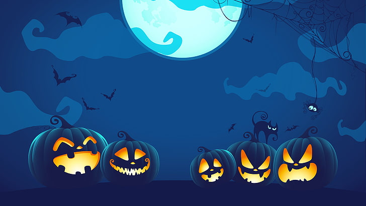
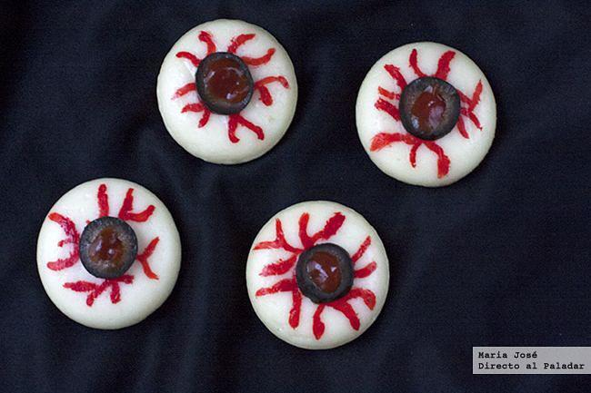
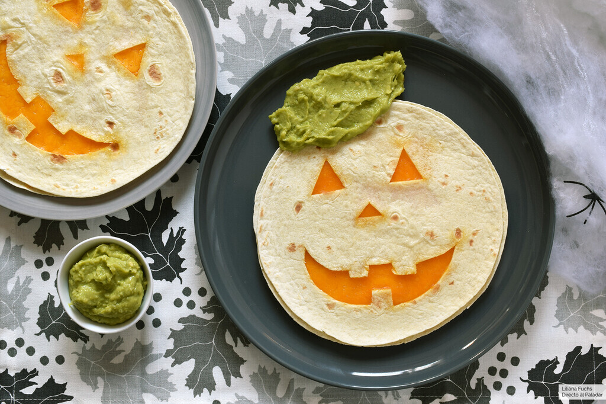

### P04--Entornos Javier Bueno Cobo 1ºDaw
___

___
# Recetas escalofriantes 🎃
 ### ✝ Este halloween que no te asusten...! 
 * ✝ Prepara la receta más terroríficamente deliciosa para este noche de los muertos.
 * ✝ Se acercan dos recetas super sencillas...

> https://www.directoalpaladar.com/recetario/11-recetas-faciles-y-rapidas-para-halloween

# **1.Ojos de queso espeluznantes** 👁️
___

### Ingredientes:

| Ingrediente                | Unidades     |
|----------------------------|--------------|
| Quesitos redondos          | ***6 uds***  |
| Aceitunas negras sin hueso | ***3 uds***  |
| Colorante alimentario rojo | ----------   |
| Tomate o ketchup           | ( al gusto ) |
  
### Preparación:
Dificultad: **media**  
Tiempo: **10 '**
  
> Dibujamos las "venitas" en los quesitos con el colorante rojo. Decoramos con las aceitunas negras cortadas en rojo y rellenamos el centro de cada aceituna con unas gotas de kétchup.

# **2.Quesadillas halloween** 👹
___

### Ingredientes:

| Ingrediente *(2px)*       | Unidades           |
|---------------------------|--------------------|
| Tortillas harina o trigo  | ***4 uds***        |
| Aceite oliva virgen extra | *(preparo sartén)* |
| Queso cheddar rayado      | ----------         |
| Guacamole                 | *( al gusto )*     |
  
### Enlaces de la práctica:
  
> https://www.directoalpaladar.com/recetas-de-aperitivos/quesadillas-calabaza-halloween-guacamole-receta-facil-divertida-para-fiesta-casa

****
  

  
  
  
   
  
  

   
    

